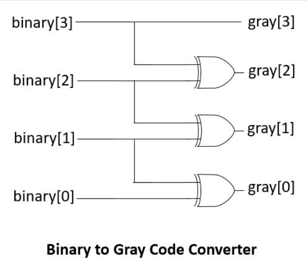
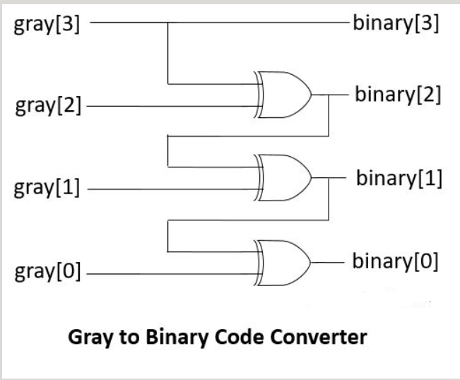

# Binary to Gray and Gray to Binary Converter

This folder contains Verilog/SystemVerilog implementation of a **Binary to Gray Code Converter** and **Gray Code to Binary Converter**.

The design is parameterized, so the bit-width can be changed using the `WIDTH` parameter.

---

## Repository Structure

```text
.
|-- b2gg2b.v
|-- images
|   |-- B2G & G2B simulation.png
|   |-- B2G.png
|   `-- G2B.png
`-- tb.sv
```

---

## Binary to Gray Code Conversion

### Logic

For binary to gray conversion:

```verilog
assign gray = bin ^ (bin >> 1);
```

This works because each Gray bit is generated by XORing adjacent binary bits.

For 4-bit conversion:

```text
gray[3] = binary[3]
gray[2] = binary[3] ^ binary[2]
gray[1] = binary[2] ^ binary[1]
gray[0] = binary[1] ^ binary[0]
```

### Circuit Diagram



---

## Gray to Binary Code Conversion

### Logic

For gray to binary conversion, the MSB remains the same, and each lower binary bit is generated by XORing the previous binary bit with the current gray bit.

For 4-bit conversion:

```verilog
assign binary[3] = gray[3];
assign binary[2] = gray[3] ^ gray[2];
assign binary[1] = gray[3] ^ gray[2] ^ gray[1];
assign binary[0] = gray[3] ^ gray[2] ^ gray[1] ^ gray[0];
```

Or generally:

```text
binary[i] = gray[WIDTH-1] ^ gray[WIDTH-2] ^ ... ^ gray[i]
```

### Circuit Diagram



---

## Simulation Output

The testbench applies all 4-bit binary input combinations and verifies:

```text
binary → gray → binary_back
```

So the converted binary output should match the original binary input.


---

## Example Conversion

| Binary | Gray |
|---|---|
| 0000 | 0000 |
| 0001 | 0001 |
| 0010 | 0011 |
| 0011 | 0010 |
| 0100 | 0110 |
| 0101 | 0111 |
| 0110 | 0101 |
| 0111 | 0100 |

---

## Files

| File | Description |
|---|---|
| `b2gg2b.v` | Contains binary-to-gray and gray-to-binary modules |
| `tb.sv` | Testbench for verifying both conversions |
| `images/` | Contains circuit diagrams and simulation output |

---

## Key Learning Points

- Gray code changes only one bit between consecutive values.
- Binary to Gray conversion can be done using XOR and right shift.
- Gray to Binary conversion uses cumulative XOR from MSB to LSB.
- Parameterized RTL makes the converter reusable for different bit-widths.
- Testbench verifies round-trip conversion: `binary → gray → binary`.

---

## Future Extensions

- 8-bit and 16-bit converter
- separate B2G and G2B modules
- waveform verification
- integration with counters
- asynchronous FIFO pointer conversion
