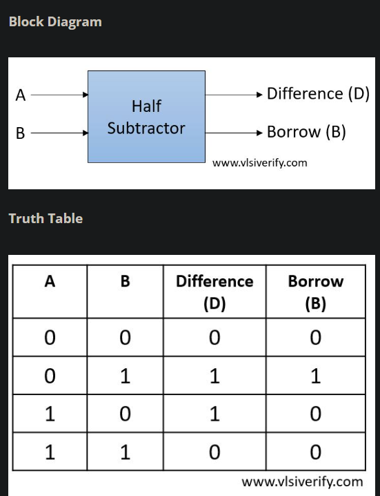
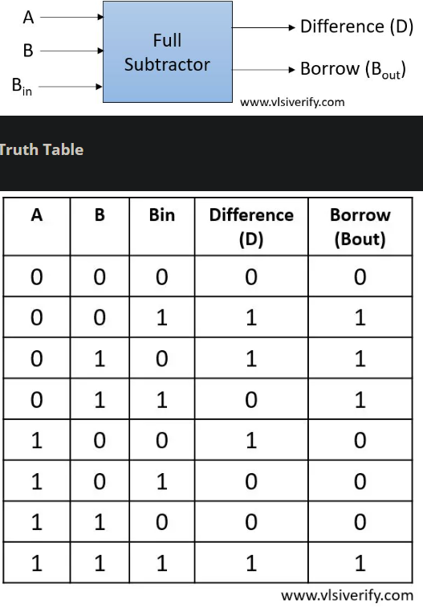

# SUBTRACTORS

Implementation and exploration of Half Subtractor and Full Subtractor circuits using Verilog/SystemVerilog.

This folder explores:
- combinational arithmetic circuits
- subtraction logic
- borrow generation
- hierarchical hardware design
- Full Subtractor implementation using Half Subtractors

---

# Repository Structure

```text
.
|-- fullsub_usinghs.v
|-- images
|   |-- fs simulation.png
|   |-- fs.png
|   |-- hs simulation.png
|   `-- hs.png
`-- tb.sv
```

---

# Overview

Subtractors are combinational circuits used to perform binary subtraction.

This project includes:
- Half Subtractor
- Full Subtractor

---

# 1. Half Subtractor

A Half Subtractor subtracts:

```text
A - B
```

and produces:
- Difference
- Borrow

---

# Truth Table

| A | B | Difference (D) | Borrow (B) |
|---|---|---|---|
| 0 | 0 | 0 | 0 |
| 0 | 1 | 1 | 1 |
| 1 | 0 | 1 | 0 |
| 1 | 1 | 0 | 0 |

---

# Boolean Equations

## Difference

```text
D = A ⊕ B
```

---

## Borrow

```text
Borrow = A'B
```

---

# RTL Implementation

```verilog
module half_subtractor(
    input in1,
    input in2,
    output wire dif,
    output wire bor
);

assign dif = in1 ^ in2;
assign bor = ~in1 & in2;

endmodule
```

---

# Half Subtractor Block Diagram



---

# Half Subtractor Simulation


---

# 2. Full Subtractor

A Full Subtractor performs subtraction using:

```text
A - B - Bin
```

where:
- `Bin` = Borrow Input

Outputs:
- Difference
- Borrow Output

---

# Truth Table

| A | B | Bin | Difference (D) | Borrow (Bout) |
|---|---|---|---|---|
| 0 | 0 | 0 | 0 | 0 |
| 0 | 0 | 1 | 1 | 1 |
| 0 | 1 | 0 | 1 | 1 |
| 0 | 1 | 1 | 0 | 1 |
| 1 | 0 | 0 | 1 | 0 |
| 1 | 0 | 1 | 0 | 0 |
| 1 | 1 | 0 | 0 | 0 |
| 1 | 1 | 1 | 1 | 1 |

---

# Boolean Equations

## Difference

```text
D = A ⊕ B ⊕ Bin
```

---

## Borrow

Canonical form:

```text
Bout = A'B + A'Bin + BBin
```

Optimized form:

```text
Bout = A'B + Bin(A ⊕ B)'
```

---

# Full Subtractor Using Half Subtractors

## File

```text
fullsub_usinghs.v
```

---

# Concept

A Full Subtractor can be constructed hierarchically using:
- two Half Subtractors
- one OR gate

---

# Architecture

```text
First Half Subtractor:
A - B
    ↓
Intermediate Difference + Borrow

Second Half Subtractor:
Intermediate Difference - Bin
    ↓
Final Difference + Borrow

Final Borrow:
OR of both borrow outputs
```

---

# RTL Implementation

```verilog
module full_subtractor(
    input in1,
    input in2,
    input bin,
    output wire diff,
    output wire bor
);

wire dint, bint, bint2;

half_subtractor hs1(
    .in1(in1),
    .in2(in2),
    .dif(dint),
    .bor(bint)
);

half_subtractor hs2(
    .in1(dint),
    .in2(bin),
    .dif(diff),
    .bor(bint2)
);

assign bor = bint | bint2;

endmodule
```

---

# Full Subtractor Block Diagram



---

# Full Subtractor Simulation


---

# Testbench

## File

```text
tb.sv
```

The testbench verifies:
- all input combinations
- borrow propagation
- subtraction correctness

---

# Concepts Covered

- combinational arithmetic circuits
- borrow generation
- XOR-based difference logic
- hierarchical RTL design
- modular hardware construction
- dataflow modeling
- subtraction logic verification

---

# Learning Objectives

This project introduces:
- Half Subtractor design
- Full Subtractor architecture
- borrow logic derivation
- hierarchical module instantiation
- arithmetic combinational logic
- RTL verification using testbenches

---

# Future Extensions

- gate-level subtractors
- switch-level subtractors
- ripple borrow subtractor
- arithmetic logic unit (ALU)
- signed arithmetic
- synthesis and timing analysis
